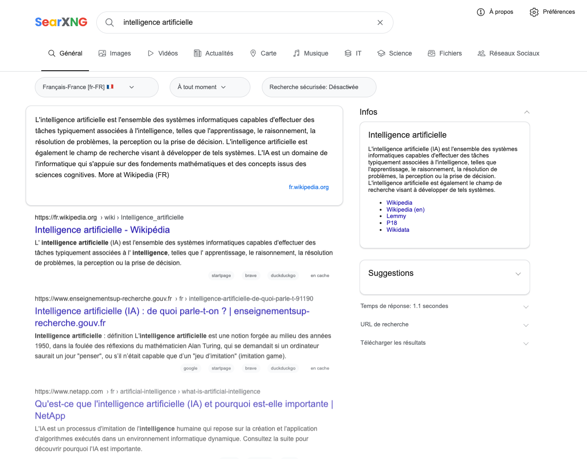
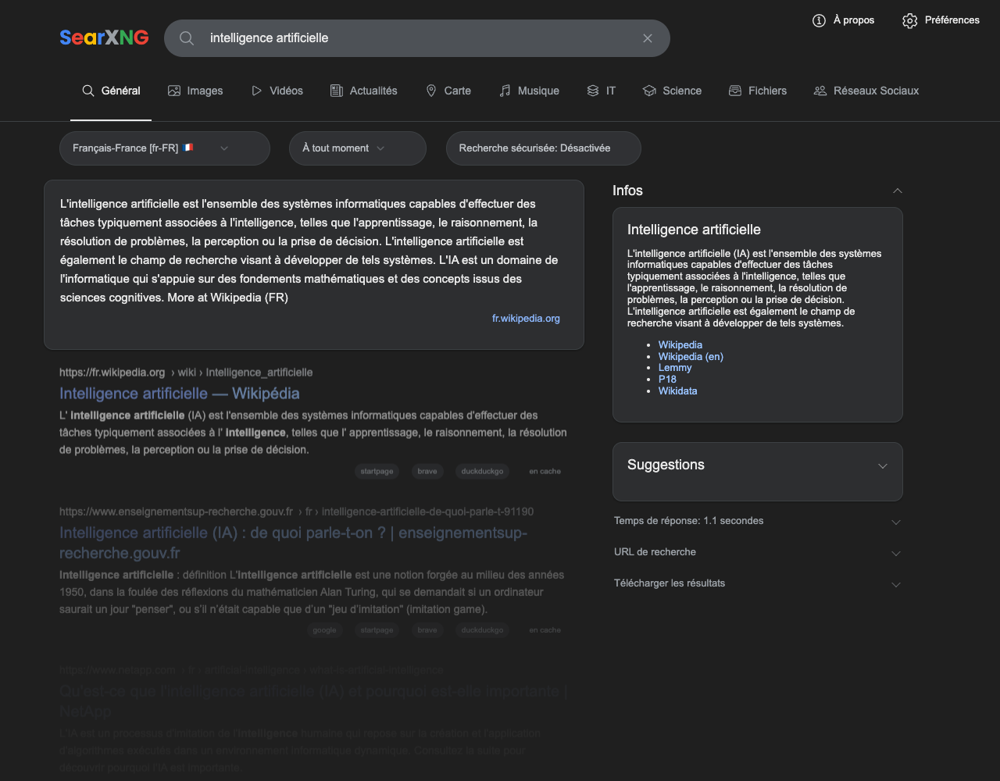
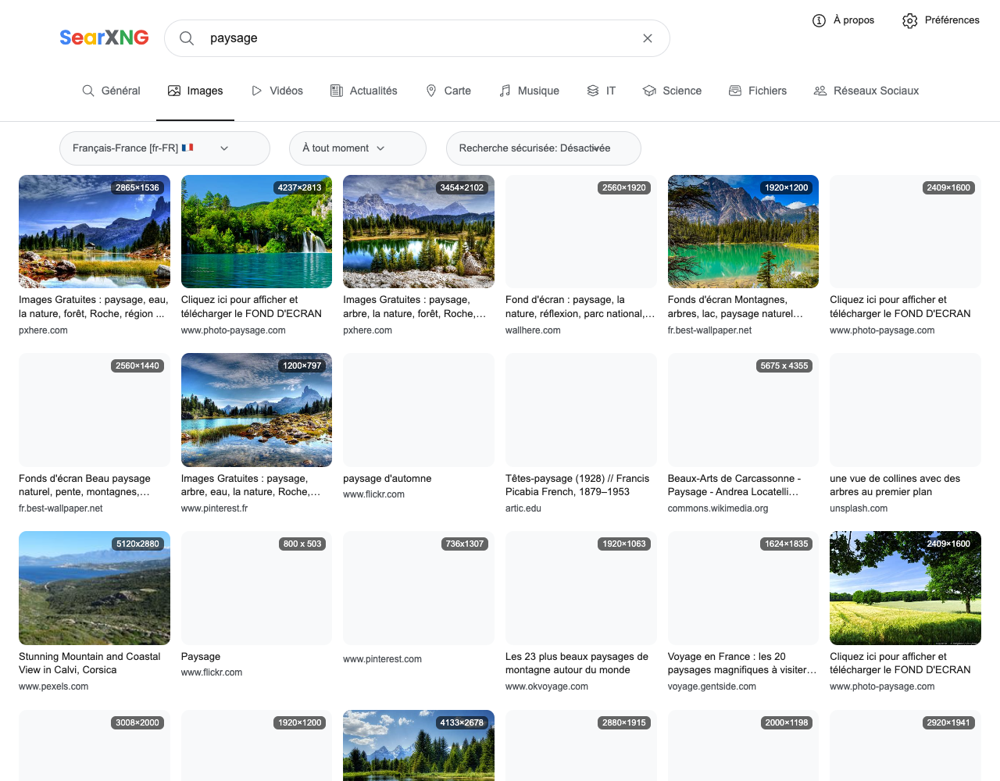
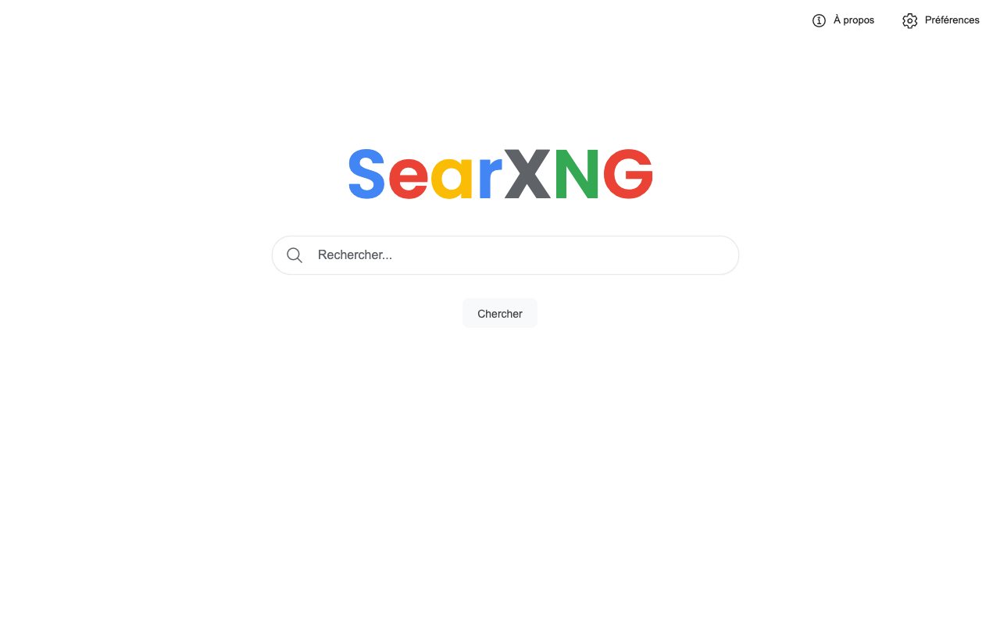

# searnxg-themes

> Des thèmes soignés pour le métamoteur de recherche [SearXNG](https://github.com/searxng/searxng) — installables en une commande, sélectionnables à côté du thème `simple` d'origine.

[](https://github.com/Dim145/searnxg-themes/actions/workflows/ci.yml)
[](https://github.com/Dim145/searnxg-themes/releases/latest)
[](LICENSE)
[](https://github.com/searxng/searxng)

Le thème **google** rhabille SearXNG aux couleurs de Google Search — **clair et sombre**, sur **toutes les pages** (accueil, résultats, images, préférences) — sans charger le moindre actif Google : polices auto-hébergées, aucun logo déposé, **rien n'est envoyé à Google**.



<table>
  <tr>
    <td width="50%"><br><sub><b>Mode sombre</b> (suit le système)</sub></td>
    <td width="50%"><br><sub><b>Images</b> — grille façon Google Images + visionneuse plein écran</sub></td>
  </tr>
  <tr>
    <td><br><sub><b>Accueil</b></sub></td>
    <td align="center"><br><sub><b>Mobile</b> — logo centré, onglets &amp; filtres défilants</sub></td>
  </tr>
</table>

## ✨ Points forts

- **Fidélité Google** — couleurs, typographie (Arial + wordmark Poppins auto-hébergé), barre de recherche en pilule, onglets, panneau de connaissances, fils d'Ariane, lightbox d'images plein écran avec spinner de chargement.
- **Clair + sombre** via le mécanisme natif de SearXNG (`auto` suit le système, ou forcé dans les préférences).
- **Toutes les pages** couvertes (fork des templates `simple` → couverture DOM intégrale) : accueil, résultats web/images/vidéos/actualités, préférences (cartes, chips, interrupteurs façon Material).
- **Responsive** jusqu'au mobile : header empilé style Google, grille d'images 2 colonnes, cibles tactiles ≥ 44 px (WCAG).
- **Vie privée d'abord** : polices `woff2` auto-hébergées (jamais `fonts.google.com`), aucune ressource tierce ajoutée.
- **Honnête** : uniquement de **vraies** fonctionnalités SearXNG — aucun bouton factice.
- **Léger** : une couche CSS posée sur le `simple` déjà compilé (pas de fork de la toolchain Vite/Less) → peu de pièces mobiles, facile à maintenir.

## 🚀 Installation

> Dépôt : **`Dim145/searnxg-themes`** (déjà câblé dans les scripts). Les commandes
> récupèrent la dernière *release* : un ZIP prêt à déposer, construit par la CI.

**Docker (searxng-docker) — persistant, image officielle conservée** *(recommandé)*

Dans le dossier de votre `docker-compose.yml` :

```bash
curl -fsSLO https://raw.githubusercontent.com/Dim145/searnxg-themes/main/docker/docker-compose.override.yml
curl -fsSLO https://raw.githubusercontent.com/Dim145/searnxg-themes/main/docker/fetch-theme.sh && chmod +x fetch-theme.sh
./fetch-theme.sh                                       # → ./searxng-google/
#   settings.yml :  ui: { default_theme: google }
docker compose up -d
```

Détails et mise à jour : [docker/README.md](docker/README.md).

**Installation native / source — une commande**

```bash
curl -fsSL https://raw.githubusercontent.com/Dim145/searnxg-themes/main/install/install.sh \
  | bash -s -- --target /usr/local/searxng/searxng-src
# essai rapide dans un conteneur lancé (non persistant) :
#   … | bash -s -- --docker searxng   (puis `docker restart searxng`)
```

**Manuel (ZIP de release)** — téléchargez `searxng-google-theme.zip` depuis [*Releases*](https://github.com/Dim145/searnxg-themes/releases/latest) :

```bash
unzip searxng-google-theme.zip
cp -r searxng-google/templates  /chemin/searxng/searx/templates/google
cp -r searxng-google/static     /chemin/searxng/searx/static/themes/google
```

Dans tous les cas : `ui.default_theme: google` dans `settings.yml` (ou choisi par
utilisateur dans *Préférences → interface → thème*), puis redémarrez SearXNG. Gardez
le thème `simple` installé. Voir [themes/google/README.md](themes/google/README.md) pour
les détails et la reconstruction du CSS.

> **Compatibilité** : le thème forke les templates `simple`, il est donc lié à une
> version de SearXNG. Chaque release indique la version testée ; sur un SearXNG bien
> plus récent, prenez une release plus récente (ou ouvrez une issue).

## 🎨 Thèmes

| Thème | Description | Aperçu |
|---|---|---|
| [**google**](themes/google/) | Ressemblance forte à Google Search, clair + sombre, toutes les pages, sans actifs déposés Google. | [captures](#searnxg-themes) · `mockups/google/` |

## 🧪 Développement

```bash
./scripts/docker-test.sh up      # SearXNG + thème via Docker → http://localhost:8888
./scripts/docker-test.sh down
cd themes/google && ./build.sh   # régénère static/sxng-*.min.css (base simple + src/google.css)
```

Aperçu pur design, sans backend (maquettes statiques) :

```bash
cd mockups/google && python3 -m http.server 8137   # http://localhost:8137/index.html
```

<details>
<summary>Structure du dépôt</summary>

```
searnxg-themes/
├── themes/google/                  ← le thème (voir themes/google/README.md)
│   ├── templates/                  → searx/templates/google/
│   ├── static/                     → searx/static/themes/google/  (css + js + img + fonts)
│   ├── src/  google.css + base-*.css (vendoré) + build.sh
│   └── README.md
├── docs/screenshots/               ← captures du README
├── mockups/google/                 ← maquettes HTML/CSS (référence design)
├── install/
│   ├── install.sh                  ← installe (local OU télécharge la release ; --target/--docker)
│   └── package.sh                  ← construit le ZIP de release
├── docker/                         ← overlay bind-mount (persistant) + fetch-theme.sh
├── .github/workflows/              ← release.yml (tag → ZIP+Release) · ci.yml (push → smoke-test)
├── scripts/                        ← docker-test.sh + settings.yml de test
├── LICENSE                         ← AGPL-3.0-or-later
└── NOTICE                          ← attribution SearXNG + marques
```
</details>

## 📦 Publier une release (mainteneur)

Le slug `Dim145/searnxg-themes` est déjà câblé partout (scripts + docs ; les workflows
utilisent `github.repository`). Pour un **fork**, remplacez-le ou passez `--repo OWNER/REPO`.

1. **Taguez** pour déclencher la CI de release (build du ZIP + création de la *Release*) :
   ```bash
   git tag google-v2026.06.07 && git push origin google-v2026.06.07
   ```
2. Le workflow `ci.yml` valide chaque push : build du ZIP, démarrage de SearXNG avec le
   thème monté, vérification que les pages rendent sans erreur de template.

ZIP en local : `./install/package.sh google` → `dist/searxng-google-theme.zip`.

## ➕ Ajouter un nouveau thème

1. Forkez `themes/google/` (ou les templates `simple` de SearXNG) vers `themes/<nom>/`.
2. Réécrivez les chemins internes `google/` → `<nom>/` dans les templates et le littéral
   `get_result_template('…')` de `results.html`.
3. Adaptez la couche `src/<nom>.css` (tokens + structure), puis `./build.sh`.
4. Ajoutez une ligne au tableau ci-dessus.

La découverte des thèmes par SearXNG est automatique (`os.listdir(searx/templates/)`) : un
dossier de templates + un dossier static du même nom suffisent à le rendre sélectionnable.

## 📄 Licence

**AGPL-3.0-or-later** (comme SearXNG) — voir [LICENSE](LICENSE). Ces thèmes sont des œuvres
dérivées de SearXNG (templates `simple` forkés + CSS/JS de base vendorés) ; voir [NOTICE](NOTICE)
pour l'attribution. « Google » et « Google Search » sont des marques de Google LLC ; ce projet
est indépendant, n'embarque aucun actif déposé et n'est pas affilié à Google.
